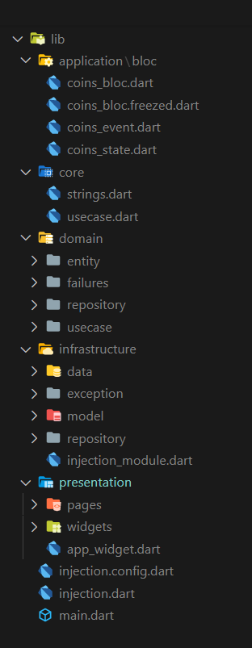

[](https://github.com/Shadow60539/crypto_flutter/actions/workflows/test.yml) [](https://github.com/Shadow60539/crypto_flutter)


# Introduction

> Coinbase is a simple prototype app which lists crypto coins.

Before we start, you can take a look at the app:

<table>
  <tr>
    <td valign="top"></td>
    <td valign="center"></td>
  </tr>
</table>


## How To Use

To clone and run this application, you'll need [Git](https://git-scm.com) and [Flutter](https://flutter.dev/docs/get-started/install) installed on your computer. From your command line:

```bash
# Clone this repository
$ git clone https://github.com/Shadow60539/crypto_flutter.git

# Go into the repository
$ cd crypto_flutter.git

# Install dependencies
$ flutter packages get

# Run the app
$ flutter run
```


### Packages


Below are the information about these packages.


package | explain
---|---
[cached_network_image](https://pub.flutter-io.cn/packages/cached_network_image) | Caching Network Images
[dartz](https://pub.flutter-io.cn/packages/dartz) | Functional Programming
[flutter_bloc](https://pub.flutter-io.cn/packages/flutter_bloc) | Bloc Pattern
[google_fonts](https://pub.flutter-io.cn/packages/google_fonts) | Google fonts 
[freezed](https://pub.flutter-io.cn/packages/freezed) | Code generation for immutable classes
[lint](https://pub.flutter-io.cn/packages/lint) | Rules handler for Dart
[build_runner](https://pub.flutter-io.cn/packages/build_runner) | Build Custom Models
[mockito](https://pub.flutter-io.cn/packages/mockito) | Testing
[dio](https://pub.flutter-io.cn/packages/dio) | Network Calls

### Directory Structure

The project directory structure is as follows:

```
├── android
├── asset
├── build
├── images
├── ios
├── lib
├── pubspec.lock
├── pubspec.yaml

```


Let me explain the other directories besides **lib**:

DIRECTORY | INFO
---|---
images | readme images files
asset | images and lottie files

Then the lib directory





DIRECTORY | INFO
---|---
[application](lib/application) | State Management 
[core](lib/core) | Global Classes
[domain](lib/domain) | Abstract Classes
[infrastructure](lib/infrastructure) | Domain implementation (backend)
[presentation](lib/presentation) | UI

